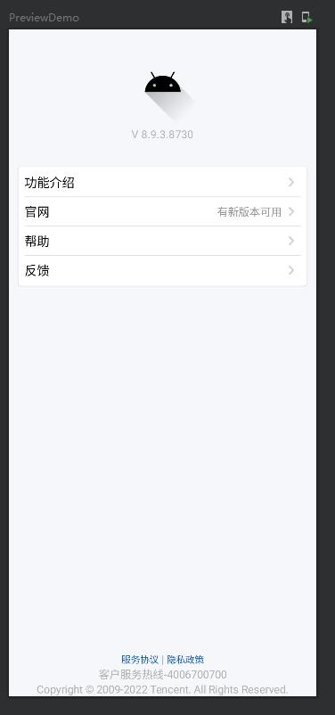
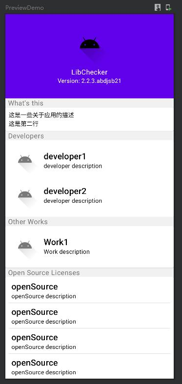

# 效果预览
|  |  |
| :--------: | :-----: |
|  |  |
|  |  |

# 集成方法
因为这个框架十分简单，所以没有打包成库，使用时直接复制 [about_pager](./app/src/main/java/com/equationl/aboutpager_compose/about_pager/) 目录到你的项目中即可。

# 使用方法
参考 [demo](./app/src/main/java/com/equationl/aboutpager_compose/about_pager/sample/SampleDemo.kt) 以及 [实现思路](./docs/README.md)

并且这个项目是完整可运行的，你可以 clone 下来跑一遍看看。