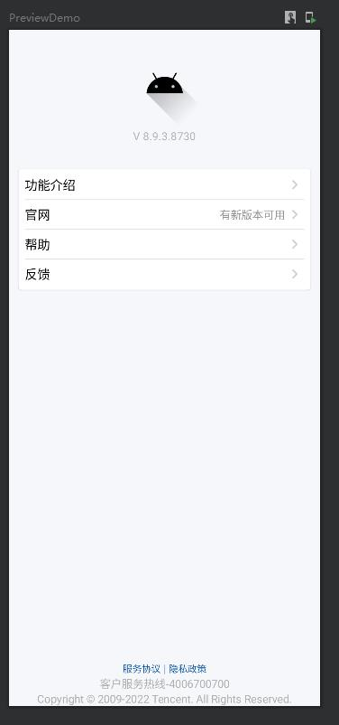
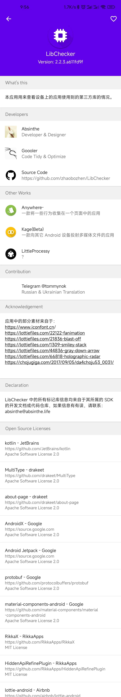

# 前言
现在很多 APP 都会有一个关于页面，用于放置一些必要的信息，例如：版本号、版权信息等。有时也会用于展示设置、帮助、反馈等功能的入口。

通常，我们都会自己挨个创建不同的 item ，略显繁琐。

所以我就在想，能不能封装一个通用的*关于*页面？在满足大多数子定义需求的情况下，尽可能的简单？

## 效果预览

|  |  |
| :--------: | :-----: |
|  |  |
|  |  |

# 实现过程

## 确定需求
首先我截取了两种不同类型的关于页面的截图：

| 仅展示信息 | 有交互 |
| :--------: | :-----: |
|  |  |
|  |  |
|  |  |

可以看到，主流的关于页面大致有两种类型，一种仅用于展示版本号、使用指南、隐私政策等信息，几乎没有需要交互的地方，这种一般在大型 APP 中比较常见。

另外一种则是混杂了许多功能，除了上面说的展示信息外，还会把设置等强交互的功能也放到关于页面，这种一般在独立开发者的 APP 中比较常见。

虽然不同类型的APP对于关于页面的设计大不相同，但是基本上都是会在顶部第一项展示 APP 图标、应用名称和一些应用基本信息。

而中间的内容，无非就是各种不同的 item，不过不同风格的 APP 排列样式不同，例如仅展示信息的 APP 几乎都是简约的普通列表形式；而其他 APP 则一般会采用 Card 或其他形式分割不同的模块，在同一个模块内依然采用列表现实不同的 item。

至于最底部的内容，通常是版权信息或政策信息等，使用普通文本居中显示。

因此，最终确定这个框架的整体布局应该类似于这样：


当然，这只是整体框架布局，三个模块中能够插入的内容应该是要能自定义的。

那么，能往这三个模块中插入的内容应该有什么呢？

按照上面的分析，我们应该预设几个可用的 item：

1. AppInfoItem 用于实现顶部APP信息的 item （icon、名称、版本号、其他信息等）
2. NormalItem 一个普通的 item
4. TextItem 一个纯文本 item
6. ItemModule 一个单独的模块，可在其中放置上述 item，用于分割不同功能类型的 item

## 编写主框架入口
为了方便使用，我们需要给这个框架编写一个主入口，所有的 composable 都应该置于这个主入口之中。

按照上面分析的分区，我们的主入口将接收三个 composable： `topContent` 、 `mainContent` 、 `bottomContent` 。

实现如下：

```kotlin
@Composable
fun AboutScreen(
    modifier: Modifier = Modifier,
    topContent: (@Composable () -> Unit)? = null,
    mainContent: (@Composable () -> Unit)? = null,
    bottomContent: (@Composable () -> Unit)? = null,
    keepBottomInBottom: Boolean = false
) {
    Box {
        Column(modifier = modifier.verticalScroll(rememberScrollState())) {
            if (topContent != null) {
                topContent()
            }
            if (mainContent != null) {
                mainContent()
            }
            if (bottomContent != null && !keepBottomInBottom) {
                bottomContent()
            }
        }

        if (bottomContent != null && keepBottomInBottom) {
            Column(Modifier.fillMaxSize(), verticalArrangement = Arrangement.Bottom) {
                bottomContent()
            }
        }
    }
}
```

因为不是每个 APP 都是完整的拥有三个内容区域，所以所有的内容区域都是使用的可空类型，然后判断不为空才显示。

并且，我们也不能预估实际使用时内容长度有多少，一个屏幕能不能显示的下，故此我们需要给父组件添加一个 `verticalScroll(rememberScrollState())` 。

另外，正如上面所说，我们无法预估内容长度，但是一般来说，最底部的版权信息肯定是要置底的，所以这里我们交给用户自己选择，如果他认为他的内容不会超出屏幕可显示区域，则传入 `keepBottomInBottom` 参数为 true。

此时，底部内容 `bottomContent` 将不会堆叠在在 `Column` 中，而是会往上提一层到上一级的 `Box` 中，与 `Column` 同级别。然后将其设置为填充最大可用尺寸，并将内容置于最底部。

额外插两句，`Column` 表示垂直排列它包裹的所有 composable，类似 view 中的 `LinearLayout` ；`Box` 表示直接叠加其中的所有 composable ，类似 `FrameLayout`。

## 编写头部布局
头部一般都是用于存放 APP 的基本信息，因此我们可以封装一个通用的基本信息组件，但是为了不过于死板，应当留下足够的可扩展空间。

所以我们先写一个基础组件：

```kotlin
/**
 * 头部 APP 信息基础 Item
 * 
 * @param iconContent 图标内容
 * @param textContent 文本内容
 * @param modifier Modifier
 * */
@Composable
fun AppInfoVerticalItem(
    iconContent: @Composable () -> Unit,
    textContent: @Composable () -> Unit,
    modifier: Modifier = Modifier
) {
    Column(modifier = modifier) {
        iconContent()
        textContent()
    }
}
```

代码很简单，就是一个 `Column` 接收两个 composable 内容，图标内容和文本内容。

什么？你问我为什么明明两个参数都是 composable 而且也没有做什么特殊处理，为什么要用两个参数，只用一个不行吗？

这个问题就留给各位读者自己思考了哈哈ヾ(≧▽≦*)oψ(｀∇´)ψ

对了，看到这里的函数名字 `AppInfoVerticalItem` 应该就想到，既然有垂直的，那就是说还有水平的咯？没错是这样的：

```kotlin
@Composable
fun AppInfoHorizontalItem(
    iconContent: @Composable () -> Unit,
    textContent: @Composable () -> Unit,
    modifier: Modifier = Modifier
) {
    Row(modifier = modifier, horizontalArrangement = Arrangement.SpaceBetween) {
        iconContent()
        textContent()
    }
}
```

定义完基础组件肯定是不够的，我们应该要封装一个开箱即用的组件才是这个框架的目的：

```kotlin
@Composable
fun AppInfoVerticalItem(
    iconPaint: Painter,
    modifier: Modifier = Modifier,
    text: String? = null,
    subText: String? = null,
    textStyle: TextStyle = MaterialTheme.typography.h4,
    subTextStyle: TextStyle = MaterialTheme.typography.body2
) {
    AppInfoVerticalItem(
        iconContent = {
            Column(Modifier.fillMaxWidth(), horizontalAlignment = Alignment.CenterHorizontally) {
                Icon(
                    painter = iconPaint,
                    contentDescription = "icon"
                )
            }
        },
        textContent = {
            Column(Modifier.fillMaxWidth(), horizontalAlignment = Alignment.CenterHorizontally) {

                if (text != null) {
                    Text(
                        text = text,
                        style = textStyle,
                        maxLines = 1
                    )
                }

                if (subText != null) {
                    Text(
                        text = subText,
                        style = subTextStyle
                    )
                }

            }
        },
        modifier = modifier
    )
}
```

在上面的代码中了，为了易于修改文本的样式，我们预留了 `textStyle` 和 `subTextStyle` 参数，可以使用 style 修改文本的颜色、字号、修饰符、字体等信息。

因为我们说过，在这里的图标一般都是 APP 的 icon ， 所以这里就直接固定图标类型为 `Painter` ， 而没有多重载几个方法，覆盖可使用的所有图标类型（`ImageVector` 、 `ImageBitmap`）

上面的组件封装后只需要“一行”代码即可调用：

```kotlin
@Preview(backgroundColor = 0xFFFFFFFF, showBackground = true)
@Composable
fun PreviewVerticalAppInfoItem() {
    AppInfoVerticalItem(
        iconPaint = painterResource(id = R.drawable.ic_launcher_foreground),
        text = "示例APP",
        subText = "V1.0.0"
    )
}
```

显示效果如下：


水平显示同理，这里不再赘述。

## 编写主要内容布局
编写思路同上，其实这个没有什么难度，不过就是拿几个基础 composable 做堆叠组合而已，所以我这里直接上代码了，需要注意的地方已经在代码中注释说明：

```kotlin
/**
 * 一个独立的模块，使用 Card 作为载体
 *
 * @param modifier Modifier
 * @param title 模块标题，会被置于载体 Card 之外
 * @param backGroundColor Card 背景颜色
 * @param border Card 变宽
 * @param elevation Card 高度（会影响 Card 的阴影深度）
 * @param shape Card 形状（可自定义形状或增加圆角）
 * @param titleStyle 标题文本的样式
 * @param content 内容
 * */
@OptIn(ExperimentalMaterialApi::class)
@Composable
fun ModuleItem(
    modifier: Modifier = Modifier,
    title: String? = null,
    backGroundColor: Color = Color.Unspecified,
    border: BorderStroke? = null,
    elevation: Dp = 1.dp,
    shape: Shape = MaterialTheme.shapes.medium,
    titleStyle: TextStyle = MaterialTheme.typography.h5,
    content: @Composable () -> Unit
) {
    Column {
        if (title != null) {
            // 将标题文本放到 Card 外面，这样比较美观
            Text(
                text = title,
                style = titleStyle,
                modifier = Modifier.padding(start = 6.dp)
            )
        }

        Card(
            onClick = { }, // 其实这里只是将 card 作为外部载体使用，不需要直接点击 card，但是这个参数是必须的，所以直接传一个空的给它
            enabled = false, // 禁用点击
            modifier = modifier.fillMaxWidth(),
            backgroundColor = backGroundColor,
            border = border,
            elevation = elevation,
            shape = shape
        ) {
            Column(modifier = Modifier.padding(8.dp)) {
                content()
            }
        }
    }
}

/**
 * 基础 Item 载体，使用 Row 作为载体承载内容
 *
 * @param startContent 左边的内容
 * @param endContent 右边的内容
 * @param modifier Modifier
 * @param horizontalArrangement 水平对齐方式
 * @param verticalAlignment 垂直对齐方式
 * */
@Composable
fun BaseSubItem(
    startContent: @Composable () -> Unit,
    endContent: @Composable () -> Unit,
    modifier: Modifier = Modifier,
    horizontalArrangement: Arrangement.Horizontal = Arrangement.SpaceBetween,
    verticalAlignment: Alignment.Vertical = Alignment.Top
) {
    Row(
        modifier = modifier.fillMaxWidth(),
        horizontalArrangement = horizontalArrangement,
        verticalAlignment = verticalAlignment
    ) {
        startContent()
        endContent()
    }
}

/**
 * 一般 Item，显示效果形如普通文本列表，但是可以添加尾部图标与尾部文字，建议包裹在 [NormalSubItemModule] 使用
 *
 * @param startText 主文本，位于列表最左边
 * @param modifier Modifier
 * @param endText 辅助文本，位于列表最右边，但是在 [endIcon] 左边
 * @param startTextStyle 主文本样式
 * @param endTextStyle 辅助文本样式
 * @param endIcon 尾部图标
 * @param onClick 点击回调
 * */
@Composable
fun NormalSubItem(
    startText: String,
    modifier: Modifier = Modifier,
    endText: String? = null,
    startTextStyle: TextStyle = LocalTextStyle.current,
    endTextStyle: TextStyle = LocalTextStyle.current,
    endIcon: (@Composable () -> Unit)? = null,
    onClick: (() -> Unit)? = null
) {
    BaseSubItem(
        // 这里如果没有设置点击回调则不添加 clickable，因为如果即使添加的是空 lambda 也会有点击涟漪效果，不太美观
        modifier = if (onClick != null) modifier.clickable { onClick() } else modifier,
        startContent = {
            Text(text = startText, style = startTextStyle)
        },
        endContent = {
            Row(verticalAlignment = Alignment.CenterVertically) {
                if (endText != null) {
                    Text(text = endText, style = endTextStyle)
                }
                if (endIcon != null) {
                    endIcon()
                }
            }
        },
        verticalAlignment = Alignment.CenterVertically
    )
}

/**
 * 带有前导图标的一般 Item ，显示效果类似对话框，建议包裹在 [NormalWithStartIconSubItemModule] 中使用
 *
 * @param text 主文本
 * @param modifier Modifier
 * @param subText 辅助文本
 * @param textStyle 主文本样式
 * @param subTextStyle 辅助文本样式
 * @param isAlignIcon 是否留空，如果设置为 true，那么即使没有图标也会将图标位置留空占位
 * @param startIcon 图标
 * @param onClick 点击回调
 * */
@Composable
fun NormalWithStartIconSubItem(
    text: String,
    modifier: Modifier = Modifier,
    subText: String? = null,
    textStyle: TextStyle = MaterialTheme.typography.h6,
    subTextStyle: TextStyle = MaterialTheme.typography.body2,
    isAlignIcon: Boolean = true,
    startIcon: (@Composable () -> Unit)? = null,
    onClick: (() -> Unit)? = null
) {
    BaseSubItem(
        modifier = if (onClick != null) modifier.clickable { onClick() } else modifier,
        horizontalArrangement = Arrangement.Start,
        verticalAlignment = Alignment.CenterVertically,
        startContent = {
            // 如果条件满足的话，即使图标为空，也要把位置留空出来，即 fillMaxWidth(0.2f)
            Column(Modifier.fillMaxWidth(if (!isAlignIcon && startIcon == null) 0f else 0.2f)) {
                if (startIcon != null) {
                    startIcon()
                }
            }

            Column(modifier = Modifier.padding(start = 6.dp).fillMaxWidth(0.8f)) {
                Text(text = text, style = textStyle)
                if (subText != null) {
                    Text(text = subText, style = subTextStyle)
                }
            }
        },
        // 由于该组件风格不是严格的左右布局，所以这里将内容全放入 startContent 中，不使用 endContent
        endContent = {  }
    )
}

/**
 *
 * 用于承载 [NormalSubItem] 的模块，会将传入的所有 [NormalSubItem] 放入同一个 Card 中
 *
 * @param itemList 内容列表
 * @param modifier 承载这个 module 的父 composable 的 modifier
 * @param title 该模块标题
 * @param showDivider 是否在 item 之间显示分割线
 * @param showAllDivider 是否在第一个 item 之前 和 最后一个 item 之后显示分割线
 * @param backGroundColor 模块背景颜色
 * @param border 模块边框
 * @param elevation 模块高度（影响阴影深度）
 * @param itemPadding item 之间的 padding
 * @param startTextStyle 主文本样式
 * @param endTextStyle 辅助文本样式
 * @param cardShape 模块形状
 * @param titleStyle 标题样式
 * @param extraContent 额外的子定义内容，会在最后显示
 * @param onClick 点击回调，参数为点击的 item 索引
 * */
@Composable
fun NormalSubItemModule(
    itemList: List<NormalSubItemData>,
    modifier: Modifier = Modifier,
    title: String? = null,
    showDivider: Boolean = true,
    showAllDivider: Boolean = false,
    backGroundColor: Color = Color.Unspecified,
    border: BorderStroke? = null,
    elevation: Dp = 1.dp,
    itemPadding: Dp = 6.dp,
    startTextStyle: TextStyle = LocalTextStyle.current,
    endTextStyle: TextStyle = LocalTextStyle.current,
    cardShape: Shape = MaterialTheme.shapes.medium,
    titleStyle: TextStyle = MaterialTheme.typography.h5,
    extraContent: (@Composable () -> Unit)? = null,
    onClick: ((clickNo: Int) -> Unit)? = null
) {
    ModuleItem(
        title = title,
        modifier = modifier,
        backGroundColor = backGroundColor,
        border = border,
        elevation = elevation,
        shape = cardShape,
        titleStyle = titleStyle
    ) {
        if (showAllDivider) {
            Divider(modifier = Modifier.padding(bottom = itemPadding))
        }
        itemList.forEachIndexed { index: Int, normalSubItemData: NormalSubItemData ->
            NormalSubItem(
                normalSubItemData.startText,
                endIcon = normalSubItemData.endIcon,
                onClick =
                if (onClick == null) null
                else { { onClick(index) } },
                endText = normalSubItemData.endText,
                modifier = Modifier.padding(bottom = if (!showAllDivider && index == itemList.lastIndex) 0.dp else itemPadding),
                startTextStyle = startTextStyle,
                endTextStyle = endTextStyle
            )
            if (showDivider && index != itemList.lastIndex) {
                Divider(modifier = Modifier.padding(bottom = itemPadding))
            }
        }
        if (showAllDivider) {
            Divider(modifier = Modifier.padding(bottom = itemPadding))
        }
        if (extraContent != null) {
            extraContent()
        }
    }
}

/**
 *
 * 用于承载 [NormalWithStartIconSubItem] 的模块，会将传入的所有 [NormalWithStartIconSubItem] 放入同一个 Card 中
 *
 * @param itemList 内容列表
 * @param modifier 承载这个 module 的父 composable 的 modifier
 * @param title 该模块标题
 * @param showDivider 是否在 item 之间显示分割线
 * @param showAllDivider 是否在第一个 item 之前 和 最后一个 item 之后显示分割线
 * @param backGroundColor 模块背景颜色
 * @param border 模块边框
 * @param elevation 模块高度（影响阴影深度）
 * @param itemPadding item 之间的 padding
 * @param textStyle 主文本样式
 * @param subTextStyle 辅助文本样式
 * @param cardShape 模块形状
 * @param titleStyle 标题样式
 * @param extraContent 额外的子定义内容，会在最后显示
 * @param onClick 点击回调，参数为点击的 item 索引
 * */
@Composable
fun NormalWithStartIconSubItemModule(
    itemList: List<NormalSubItemWithStartIconData>,
    modifier: Modifier = Modifier,
    title: String? = null,
    showDivider: Boolean = true,
    showAllDivider: Boolean = false,
    backGroundColor: Color = Color.Unspecified,
    border: BorderStroke? = null,
    elevation: Dp = 1.dp,
    itemPadding: Dp = 6.dp,
    isAlignIcon: Boolean = true,
    textStyle: TextStyle = MaterialTheme.typography.h6,
    subTextStyle: TextStyle = MaterialTheme.typography.body2,
    cardShape: Shape = MaterialTheme.shapes.medium,
    titleStyle: TextStyle = MaterialTheme.typography.h5,
    extraContent: (@Composable () -> Unit)? = null,
    onClick: ((clickNo: Int) -> Unit)? = null
) {
    ModuleItem(
        title = title,
        modifier = modifier,
        backGroundColor = backGroundColor,
        border = border,
        elevation = elevation,
        shape = cardShape,
        titleStyle = titleStyle
    ) {
        if (showAllDivider) {
            Divider(modifier = Modifier.padding(bottom = itemPadding))
        }
        itemList.forEachIndexed { index: Int, normalSubItemWithStartIconData: NormalSubItemWithStartIconData ->
            NormalWithStartIconSubItem(
                normalSubItemWithStartIconData.text,
                subText = normalSubItemWithStartIconData.subText,
                startIcon = normalSubItemWithStartIconData.startIcon,
                onClick =
                if (onClick == null) null
                else { { onClick(index) } },
                modifier = Modifier.padding(bottom = itemPadding),
                textStyle = textStyle,
                subTextStyle = subTextStyle,
                isAlignIcon = isAlignIcon
            )
            if (showDivider && index != itemList.lastIndex) {
                Divider(modifier = Modifier.padding(bottom = itemPadding))
            }
        }
        if (showAllDivider) {
            Divider(modifier = Modifier.padding(bottom = itemPadding))
        }
        if (extraContent != null) {
            extraContent()
        }
    }
}

data class NormalSubItemData(
    val startText: String,
    val endText: String? = null,
    val endIcon: (@Composable () -> Unit)? = null,
)

data class NormalSubItemWithStartIconData(
    val text: String,
    val subText: String? = null,
    val startIcon: (@Composable () -> Unit)? = null,
)
```

显示效果大致如下：


## 编写底部内容布局
前面说过，底部内容一般就是一些版权信息：

```kotlin
/**
 * 基础纯文本 item
 * */
@Composable
fun BaseTextItem(
    modifier: Modifier = Modifier,
    content: @Composable () -> Unit
) {
    Column(modifier.fillMaxWidth(), horizontalAlignment = Alignment.CenterHorizontally) {
        content()
    }
}

/**
 * 版权信息文本
 * */
@Composable
fun RightsTextItem(
    dateText: String,
    name: String,
    style: TextStyle = LocalTextStyle.current
) {
    Text(text = "Copyright © $dateText $name All Rights Reserved.", style = style)
}

/**
 * 可点击的链接文本
 * */
@Composable
fun LinkText(
    text: String,
    modifier: Modifier = Modifier,
    fontSize: TextUnit = 12.sp,
    color: Color = MaterialTheme.colors.primary,
    onClick: () -> Unit) {

    Text(
        text = text,
        color = color,
        fontSize = fontSize,
        modifier = modifier.noRippleClickable(onClick = onClick) )
}

/**
 * 没有点击涟漪效果的 Clickable
 * */
inline fun Modifier.noRippleClickable(crossinline onClick: ()->Unit): Modifier = composed {
    clickable(indication = null,
        interactionSource = remember { MutableInteractionSource() }) {
        onClick()
    }
}
```

显示效果如下：


# 利用该框架快速仿写其他APP的关于页面

## 橙APP

这个是最简单的，因为本身 橙APP 的关于页面就很简单，不过得益于我们的框架，几行代码就可以搞定，但是为了追求细节，所以加了很多自定义参数，显得好像代码还是挺多的，如果自己用的话，基本都是使用默认参数，那就真是几行代码搞定。

对了，因为为了避免不必要的麻烦，我没有用他们的图标，就随便找了些图标代替（我才不会告诉你是因为我懒得扒图呢）

仿写代码如下：

```kotlin
@Composable
fun AboutChengPager() {
    val list = remember {
        listOf(
            NormalSubItemData("用户协议", endIcon = endArrow),
            NormalSubItemData("隐私政策", endIcon = endArrow)
        )
    }

    Column(
        Modifier
            .fillMaxSize()
            .background(Color(0xFFF3F3F3))) {
        AboutScreen(
            topContent = {
                AppInfoVerticalItem(
                    iconPaint = painterResource(id = R.drawable.ic_launcher_foreground),
                    text = "橙 App",
                    subText = "版本 3.13.2(204)",
                    modifier = Modifier.padding(bottom = 32.dp),
                    textStyle = MaterialTheme.typography.body1.copy(color = Color(0xFF404040)),
                    subTextStyle = MaterialTheme.typography.body2.copy(color = Color(0xFF7F7F7F))
                )
            },
            mainContent = {
                NormalSubItemModule(
                    itemList = list,
                    backGroundColor = Color.White,
                    startTextStyle = LocalTextStyle.current.copy(color = Color(0xFF404040)),
                    itemPadding = 12.dp
                )
            }
        )
    }
}
```

仿照效果：


## 微信

```kotlin
@Composable
fun AboutWechatPager() {
    val list = remember {
        listOf(
            NormalSubItemData("功能介绍", endIcon = endArrow),
            NormalSubItemData("投诉", endIcon = endArrow),
            NormalSubItemData("检查新版本", endIcon = endArrow)
        )
    }

    Column(
        Modifier
            .fillMaxSize()
            .background(Color.White)) {
        AboutScreen(
            topContent = {
                AppInfoVerticalItem(
                    iconPaint = painterResource(id = R.drawable.ic_launcher_foreground),
                    text = "微信",
                    subText = "Version 8.0.27",
                    modifier = Modifier.padding(bottom = 32.dp, top=16.dp),
                    textStyle = MaterialTheme.typography.h6.copy(fontWeight = FontWeight.Black),
                    subTextStyle = MaterialTheme.typography.body2
                )
            },
            mainContent = {
                NormalSubItemModule(
                    itemList = list,
                    backGroundColor = Color.White,
                    modifier = Modifier.padding(horizontal = 16.dp),
                    border = BorderStroke(0.dp, Color.Transparent),
                    elevation = 0.dp,
                    showAllDivider = true,
                    itemPadding = 12.dp
                )
            },
            bottomContent = {
                BaseTextItem {
                    LinkText(text = "《软件许可及服务协议》", color = Color(0xFF5B6A81)) {}
                    Row {
                        LinkText(text = "《隐私保护指引摘要》", color = Color(0xFF5B6A81)) {}
                        LinkText(text = "《隐私保护指引》", color = Color(0xFF5B6A81)) {}
                    }
                    Text(text = "客服电话：400 670 0700", color = Color(0xFFB1B1B1))
                    Text(text = "腾讯公司 版权所有", color = Color(0xFFB1B1B1))
                    RightsTextItem(
                        dateText = "2011-2022",
                        name = "Tencent.",
                        style = LocalTextStyle.current.copy(color = Color(0xFFB1B1B1))
                    )
                }
            },
            keepBottomInBottom = true
        )
    }
}
```

效果如下：


微信的关于页相对于常规关于页，它去掉了中间内容模块的边框，增加了两条分割线，所以在仿写时我们需要设置参数：

```kotlin
NormalSubItemModule(
    itemList = list,
    backGroundColor = Color.White,
    modifier = Modifier.padding(horizontal = 16.dp),
    border = BorderStroke(0.dp, Color.Transparent), // 设置边框线宽为0，颜色为透明，即隐藏边框
    elevation = 0.dp, // 设置高度为 0， 即不要阴影
    showAllDivider = true, // 开启显示所有分割线
    itemPadding = 12.dp
)
```

## QQ

QQ的关于页与常规有两点不同：

1. 主内容列表有辅助文本和图标
2. 头部内容的图标和文字是横着排的？

关于第一点，框架本身就支持添加辅助文本，例如本例中的，为 “官网” 这个 item 添加辅助文本 “有新版本可用”。但是不支持添加额外的图标，不过这个页好解决，因为我们的 `endIcon` 接收的是一个 composable ， 也就是说，你可以自己随意添加内容。这里我们就不演示了。

关于第二点，其实，它只是一个单张的图片而已，不信你看：


仿写代码如下：

```kotlin
@Composable
fun AboutQqPager() {
    val list = remember {
        listOf(
            NormalSubItemData("功能介绍", endIcon = endArrow),
            NormalSubItemData("官网", endIcon = endArrow, endText = "有新版本可用"),
            NormalSubItemData("帮助", endIcon = endArrow),
            NormalSubItemData("反馈", endIcon = endArrow)
        )
    }

    Column(
        Modifier
            .fillMaxSize()
            .background(Color(0xFFF6F7FB))) {
        AboutScreen(
            topContent = {
                AppInfoVerticalItem(
                    iconPaint = painterResource(id = R.drawable.ic_launcher_foreground),
                    subText = "V 8.9.3.8730",
                    modifier = Modifier.padding(bottom = 32.dp, top=16.dp),
                    subTextStyle = MaterialTheme.typography.body2.copy(color = Color(0xFFB3B3BD))
                )
            },
            mainContent = {
                NormalSubItemModule(
                    itemList = list,
                    backGroundColor = Color.White,
                    modifier = Modifier
                        .padding(horizontal = 12.dp)
                        .padding(bottom = 6.dp),
                    startTextStyle = LocalTextStyle.current.copy(fontSize = 16.sp),
                    endTextStyle = LocalTextStyle.current.copy(color = Color(0xFF939393)),
                    border = BorderStroke(width = 0.dp, color = Color.Transparent)
                )
            },
            bottomContent = {
                BaseTextItem {
                    Row(verticalAlignment = Alignment.CenterVertically) {
                        LinkText(text = "服务协议", color = Color(0xFF115AA9)) {}

                        Text(text=" | ", color = Color(0xFF5A9CD9))

                        LinkText(text = "隐私政策", color = Color(0xFF115AA9)) {}
                    }
                    Text(text = "客户服务热线-4006700700", color = Color(0xFFAFAFAF))
                    RightsTextItem(
                        dateText = "2009-2022",
                        name = "Tencent.",
                        style = LocalTextStyle.current.copy(color = Color(0xFFAFAFAF))
                    )
                }
            },
            keepBottomInBottom = true
        )
    }
}
```

效果如下：


## 一个木函

一个木函的问题在于，它的头部不同于其他的所有关于页，所以这里我们直接手写。并且，它的头部布局还有一个渐变背景色，不过没关系，我们几乎为框架的每一个 composable 都预留了 `modifier` 参数，所以实现起来同样很简单。

而它的中间内容末尾又添加了两个按钮，显然不是常规 item，不过没关系，我们预留了 `extraContent`

代码如下：
```kotlin
@Composable
fun AboutBoxPager() {
    val list = remember {
        listOf(
            NormalSubItemWithStartIconData("给我好评", subText = "您的好评将会给予我们莫大的动力与帮助", startIcon = boxSampleIcon),
            NormalSubItemWithStartIconData("加入群组", subText = "加入官方群组，与四海函友交友互水", startIcon = boxSampleIcon),
            NormalSubItemWithStartIconData("分享应用", startIcon = boxSampleIcon),
            NormalSubItemWithStartIconData("小程序", startIcon = boxSampleIcon),
            NormalSubItemWithStartIconData("反馈&建议", startIcon = boxSampleIcon),
            NormalSubItemWithStartIconData("获取帮助", startIcon = boxSampleIcon),
            NormalSubItemWithStartIconData("版本状态", subText = "7.10.2-normal", startIcon = boxSampleIcon)
        )
    }

    Column(
        Modifier
            .fillMaxSize()
            .background(Color.White)) {
        AboutScreen(
            topContent = {
                Column(
                    modifier = Modifier.background(
                        brush = Brush.verticalGradient(
                            listOf(
                                Color(0xFF89B6A2),
                                Color.White
                            )
                        )
                    )
                ) {
                    ModuleItem(
                        modifier = Modifier
                            .padding(12.dp)
                            .background(Color.White)) {
                        Column(modifier = Modifier.padding(bottom = 16.dp)) {
                            Row(Modifier.fillMaxWidth(), horizontalArrangement = Arrangement.Center) {
                                Icon(painter = painterResource(id = R.drawable.ic_launcher_foreground), contentDescription = "logo")
                            }
                            BaseTextItem {
                                Text(
                                    text = "拥有很多，不如有我。",
                                    Modifier.padding(vertical = 6.dp),
                                    style = MaterialTheme.typography.h6
                                )
                            }
                            Row(
                                Modifier
                                    .fillMaxWidth()
                                    .padding(top = 8.dp), horizontalArrangement = Arrangement.SpaceBetween) {
                                Row {
                                    Icon(
                                        imageVector = Icons.Outlined.Star,
                                        contentDescription = "star",
                                        modifier = Modifier.padding(start = 16.dp, end=12.dp),
                                        tint = Color.Cyan
                                    )

                                    Icon(
                                        imageVector = Icons.Outlined.Star,
                                        contentDescription = "star",
                                        tint = Color.Magenta
                                    )
                                }
                                LinkText(
                                    text = "开源许可",
                                    modifier = Modifier.padding(end = 16.dp),
                                    color = Color(0xFF89B6A2)
                                ) {}
                            }
                        }
                    }
                }
            },
            mainContent = {
                NormalWithStartIconSubItemModule(
                    itemList = list,
                    modifier = Modifier.padding(12.dp),
                    backGroundColor = Color.White,
                    showDivider = false,
                    elevation = 2.dp,
                    itemPadding = 24.dp,
                    textStyle = MaterialTheme.typography.h6.copy(color = Color(0xFF404040)),
                    subTextStyle = MaterialTheme.typography.body2.copy(color = Color(0xFF797979)),
                    cardShape = RoundedCornerShape(12.dp), // 定义模块框的形状，这里使用圆角，且圆角大小为 12 dp
                    extraContent = {
                        Row(
                            Modifier
                                .fillMaxWidth()
                                .padding(top = 8.dp), horizontalArrangement = Arrangement.End) {
                            Row(Modifier.fillMaxWidth(0.5f), horizontalArrangement = Arrangement.SpaceEvenly) {
                                LinkText(text = "隐私政策", color = Color(0xFF89B6A2)) { }
                                LinkText(text = "用户协议", color = Color(0xFF89B6A2)) { }
                            }
                        }
                    }
                )
            },
            bottomContent = {
                BaseTextItem {
                    Text(
                        text = "花筏科技 版权所有",
                        modifier = Modifier.padding(bottom = 16.dp, start = 8.dp),
                        color = Color(0xFF797979)
                    )
                    RightsTextItem(
                        dateText = "2017-2022",
                        name = "Sakuraft",
                        style = LocalTextStyle.current.copy(color = Color(0xFF797979))
                    )
                }
            }
        )
    }
}
```

效果如下：


## LibChecker

LibChecker 也很简单，唯一一个不同的地方是只有它使用到了模块标题。

并且它在某些模块中没有显示 item 列表，而是直接显示纯文本，这个问题也不大，传一个空列表进去再通过 `extraContent` 自定义文本即可：

```kotlin
@Composable
fun AboutLibPager() {
    val sampleIcon = @Composable {
        Row(modifier = Modifier.fillMaxWidth(), horizontalArrangement = Arrangement.Center) {
            Icon(painter = painterResource(id = R.drawable.ic_launcher_foreground), contentDescription = "icon", tint = Color(0xFF797979))
        }
    }

    val developerList = remember {
        listOf(
            NormalSubItemWithStartIconData("developer1", subText = "developer description", startIcon = sampleIcon),
            NormalSubItemWithStartIconData("developer2", subText = "developer description", startIcon = sampleIcon),
        )
    }

    val otherWorkList = remember {
        listOf(
            NormalSubItemWithStartIconData("Work1", subText = "Work description", startIcon = sampleIcon),
        )
    }

    val contributorList = remember {
        listOf(
            NormalSubItemWithStartIconData("contributorList", subText = "contributorList description", startIcon = sampleIcon)
        )
    }

    val openSourceList = remember {
        listOf(
            NormalSubItemWithStartIconData("openSource", subText = "openSource description"),
            NormalSubItemWithStartIconData("openSource", subText = "openSource description"),
            NormalSubItemWithStartIconData("openSource", subText = "openSource description"),
            NormalSubItemWithStartIconData("openSource", subText = "openSource description"),
            NormalSubItemWithStartIconData("openSource", subText = "openSource description"),
        )
    }

    Column(
        Modifier
            .fillMaxSize()
            .background(Color(0xFFF1F1F1))) {
        AboutScreen(
            topContent = {
                AppInfoVerticalItem(
                    iconPaint = painterResource(id = R.drawable.ic_launcher_foreground),
                    text = "LibChecker",
                    subText = "Version: 2.2.3.abdjsb21",
                    modifier = Modifier
                        .background(Color(0xFF6101EB))
                        .padding(bottom = 32.dp, top = 16.dp),
                    textStyle = MaterialTheme.typography.body1.copy(color = Color.White),
                    subTextStyle = MaterialTheme.typography.body2.copy(color = Color.White),
                )
            },
            mainContent = {
                NormalSubItemModule(
                    itemList = listOf(),
                    title = "What's this",
                    backGroundColor = Color.White,
                    titleStyle = MaterialTheme.typography.body1.copy(color = Color(0xFF737373)),
                    extraContent = {
                        Text(text = "这是一些关于应用的描述\n这是第二行")
                    }
                )

                NormalWithStartIconSubItemModule(
                    itemList = developerList,
                    title = "Developers",
                    titleStyle = MaterialTheme.typography.body1.copy(color = Color(0xFF737373)),
                    backGroundColor = Color.White,
                    showDivider = false
                )

                NormalWithStartIconSubItemModule(
                    itemList = otherWorkList,
                    title = "Other Works",
                    titleStyle = MaterialTheme.typography.body1.copy(color = Color(0xFF737373)),
                    backGroundColor = Color.White,
                    showDivider = false
                )

                // 下面这些其实就是重复组件，为了能够一屏显示完，这里给注释掉

                /*NormalWithStartIconSubItemModule(
                    itemList = contributorList,
                    title = "Contribution",
                    titleStyle = MaterialTheme.typography.body1.copy(color = Color(0xFF737373)),
                    backGroundColor = Color.White,
                    showDivider = false
                )*/

                /*NormalSubItemModule(
                    itemList = listOf(),
                    title = "Acknowledgement",
                    titleStyle = MaterialTheme.typography.body1.copy(color = Color(0xFF737373)),
                    backGroundColor = Color.White,
                    extraContent = {
                        Text(text = "这是一些关于版权的描述：\n第二行")
                    }
                )*/

                /*NormalSubItemModule(
                    itemList = listOf(),
                    title = "Declaration",
                    titleStyle = MaterialTheme.typography.body1.copy(color = Color(0xFF737373)),
                    backGroundColor = Color.White,
                    extraContent = {
                        Text(text = "这是一些声明")
                    }
                )*/

                NormalWithStartIconSubItemModule(
                    itemList = openSourceList,
                    titleStyle = MaterialTheme.typography.body1.copy(color = Color(0xFF737373)),
                    title = "Open Source Licenses",
                    backGroundColor = Color.White,
                    isAlignIcon = false
                )
            }
        )
    }
}
```

效果如下：

